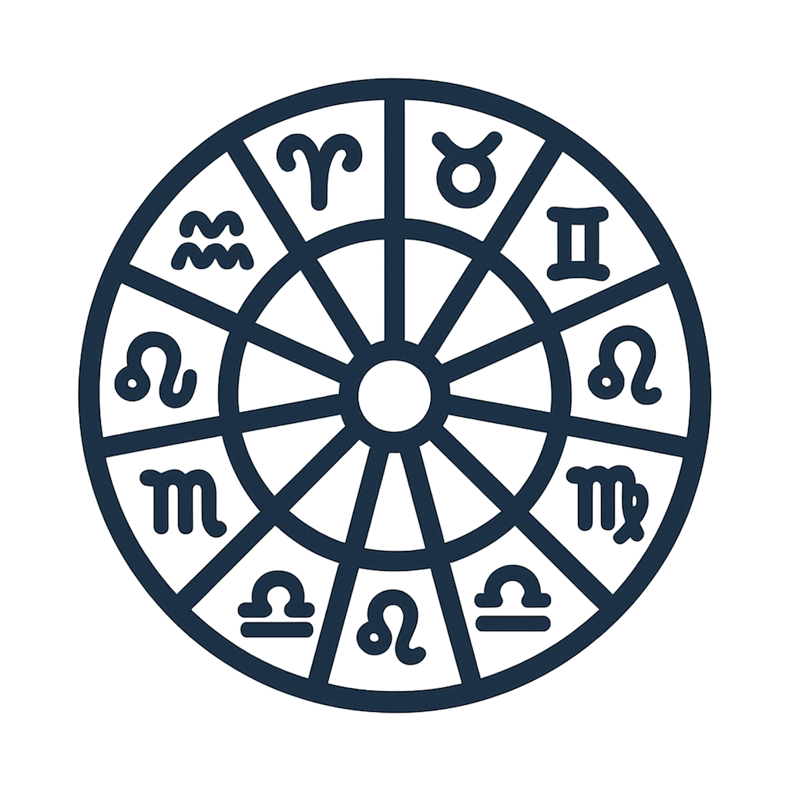

# 🌌 Multilingual AI Zodiac – Customized Horoscopes for All Signs FREE API

Unlock the stars with **Multilingual AI Zodiac**, the most flexible and intelligent horoscope API ever created.  
Powered by a **uniquely trained AI model**, this API generates **personalized, multilingual horoscopes** for all zodiac signs — instantly and with extraordinary accuracy.

<p align="center">
  🆓 <b>FREE API</b> — use instantly on 
  <a href="https://rapidapi.com/vintarok-vintarok-default/api/multilingual-ai-zodiac-customized-horoscopes-for-all-signs" target="_blank"><b>RapidAPI</b></a> 🚀
</p>

<p align="center">
  <a href="https://rapidapi.com/vintarok-vintarok-default/api/multilingual-ai-zodiac-customized-horoscopes-for-all-signs">
    
  </a>
</p>

---

## 🚀 Why Developers Love This API

### 🌍 Multilingual by Design
Deliver horoscopes in **any language** — English, Spanish, French, Russian, Japanese, Arabic, and 100+ more.  
Our system dynamically adapts to your language parameter for natural, fluent output.

### 🧠 AI-Powered Precision
Unlike static astrology datasets or templates, this API uses a **custom-trained language model** that understands context, tone, and cultural nuances.  
Every forecast is freshly generated, emotionally engaging, and free of repetition.

### 🧩 Fully Customizable
Control every aspect of generation:
- **Mode:** serious, funny, love, wellness, money, career, or spiritual  
- **Period:** day, week, month, or fully custom  
- **Language:** full name (English, Spanish, etc.)  
- **Notes/context:** set the mood, event, or use case for hyper-relevant results  

Each parameter changes the style, depth, and tone of predictions in real time.

---

## 💫 Two Simple Endpoints

### `/horoscope-all`
Get structured **JSON horoscopes for all 12 zodiac signs** in one call.  
Each sign includes 3–4 sentences — ideal for dashboards, mobile widgets, or astrology platforms.

### `/horoscope-detailed`
Generate a **deep, personalized forecast** for a single sign — up to 10 sentences.  
Perfect for chatbots, daily notifications, or premium astrology apps.

---

## 🎯 Perfect For

- **Astrology & lifestyle apps** – Deliver instant horoscopes in any language.  
- **Media platforms & blogs** – Embed fresh daily or weekly forecasts.  
- **Chatbots & virtual assistants** – Add a fun, engaging AI astrology feature.  
- **Dating & wellness apps** – Generate love, compatibility, or energy-focused horoscopes.  
- **E-commerce & marketing** – Personalize messages based on zodiac signs or moods.

---

## 🔒 Safe, Ethical & Filtered
All content is **moderated by AI safety filters** to ensure a **PG-13**, inclusive, and non-controversial experience.  
No offensive or explicit material — just inspiring, positive, and motivational forecasts.

---

## ⚙️ Example Flexibility

```http
GET /horoscope-all.php?lang=Spanish&mode=love&period=week
GET /horoscope-detailed.php?sign=leo&mode=funny&lang=French&period=day&notes=For%20Valentine%27s%20Day
```

Every combination produces **unique, localized** text that feels hand-written by a human astrologer.

---

## 🌠 Highlights

✅ AI model trained specifically for **astrology & tone adaptation**  
✅ Supports **global languages and cultural nuance**  
✅ Instant responses with &lt;2s latency  
✅ Flexible customization for **mood, period, and audience**  
✅ Scalable for production-grade apps or personal projects  

---

### ✨ The Universe Just Got API-Friendly

With **Multilingual AI Zodiac**, you’re not just reading horoscopes —  
you’re building apps that **understand personality, culture, and emotion** in every language on Earth.  

Bring the stars closer to your users — one API call at a time. 🌙

---

# 🌌 Multilingual AI Zodiac – Horoscope API

Welcome to the **Multilingual AI Zodiac API**, your all-in-one solution for generating AI-powered, multilingual horoscopes for all zodiac signs.  
Built with a **uniquely trained AI model**, this API delivers natural, personalized predictions for daily, weekly, and monthly insights — all in your preferred language.

---

## 🚀 Overview

This API offers two flexible endpoints:

1. **`/horoscope-all.php`** – Returns JSON-formatted horoscopes for all 12 zodiac signs in one request.
2. **`/horoscope-detailed.php`** – Generates a detailed horoscope for a single zodiac sign.

Both endpoints support multiple modes (serious, funny, love, career, wellness, etc.), language customization, and personal notes for deeper contextualization.

---

## 🧩 Endpoints

### 1️⃣ `/horoscope-all.php`
**Description:** Generate daily, weekly, or monthly horoscopes for **all 12 zodiac signs** in a single structured JSON response.

#### Method:
`GET`

#### Query Parameters
| Name | Type | Required | Default | Description |
|------|------|-----------|----------|--------------|
| `date` | STRING | No | Today (UTC) | Date of the horoscope in `YYYY-MM-DD` format. |
| `mode` | STRING | No | `serious` | Horoscope tone: `serious`, `funny`, `love`, `career`, `wellness`, `money`, `spiritual`. |
| `period` | STRING | No | `day` | Horoscope period: `day`, `week`, `month`, or `custom`. |
| `notes` | STRING | No | — | Optional notes or context (max 200 chars). |
| `lang` | STRING | No | `English` | Output language name (e.g., `English`, `Spanish`, `French`). |

#### Example Request
```http
GET /horoscope-all.php?date=2025-10-15&period=day&mode=funny&lang=English
```

#### Example Response
```json
{
  "ok": true,
  "text": "{ \"date\": \"2025-10-15\", \"mode\": \"funny\", \"period\": \"day\", \"horoscopes\": { \"aries\": {\"text\": \"Full of energy and ideas...\"}, \"taurus\": {\"text\": \"Focus on calm and comfort...\"}, \"gemini\": {\"text\": \"Great day for new chats...\"}, ... } }"
}
```

---

### 2️⃣ `/horoscope-detailed.php`
**Description:** Generate a **personalized, detailed horoscope** for a single zodiac sign. The text length and tone adapt dynamically to your mode, language, and period settings.

#### Method:
`GET`

#### Query Parameters
| Name | Type | Required | Default | Description |
|------|------|-----------|----------|--------------|
| `sign` | STRING | ✅ Yes | — | Zodiac sign name (e.g., `aries`, `leo`, `pisces`). |
| `date` | STRING | No | Today (UTC) | Date of the horoscope in `YYYY-MM-DD` format. |
| `mode` | STRING | No | `serious` | Horoscope tone: `serious`, `funny`, `love`, `career`, `wellness`, `money`, `spiritual`. |
| `period` | STRING | No | `day` | Horoscope duration: `day`, `week`, `month`, or `custom`. |
| `notes` | STRING | No | — | Optional notes or user context (up to 200 chars). |
| `lang` | STRING | No | `English` | Output language name (e.g., `English`, `Spanish`, `Russian`). |

#### Example Request
```http
GET /horoscope-detailed.php?sign=leo&mode=love&period=week&lang=French
```

#### Example Response
```json
{
  "ok": true,
  "text": "Leo — Your charm attracts warmth and admiration... New connections bring joy..."
}
```

---

## ⚙️ How It Works
1. The API validates and normalizes your input parameters.
2. It builds a contextual prompt for a custom-trained AI model.
3. The AI generates horoscope text in the requested language, tone, and style.
4. A moderation layer ensures all content is PG‑13, safe, and compliant.

---

## 💫 Features
- 🌍 **Multilingual:** Output in 100+ languages.  
- 🔮 **Personalized:** Each response adapts to user notes and mood settings.  
- ⚡ **Fast:** Average response time under 2 seconds.  
- 🧠 **Smart:** Unique model trained for astrology, emotion, and tone.  
- 🧩 **Flexible:** Perfect for mobile apps, bots, lifestyle sites, and media projects.

---

## 🧾 Terms of Use
- **Free plan:** For personal projects, experimentation, and learning.  
- **Paid plans:** Required for any commercial use, including apps, media, or monetized services.  
- Horoscope content is for **entertainment only** — not medical, legal, or financial advice.  

---

## 📘 Example Use Cases
- Daily horoscope apps or widgets.  
- Chatbots and voice assistants.  
- Dating or wellness platforms.  
- Personalized content for newsletters or websites.  
- Localization of astrology-based content for global audiences.

---

## 🔒 Security & Safety
- Content passes moderation before being returned.  
- Output is always PG‑13 and safe for global audiences.

---

### 🌠 The Universe, Now in Your API
Integrate **Multilingual AI Zodiac** and let your app speak the language of the stars — across cultures, moods, and moments.

**Build smarter, global astrology experiences today!**

